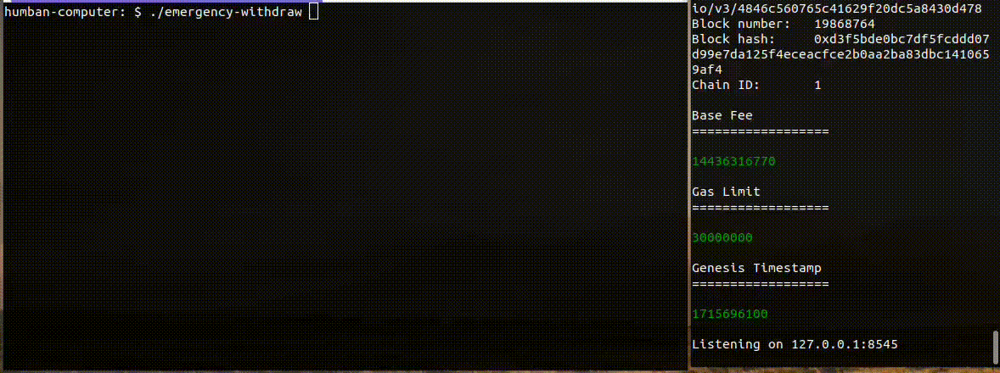

# Emergency withdraw
Terminal app created to help you to keep your ``$ETH`` if your ``pass phrase`` is compromised.

## Features
Enter your seed phrase en select wallets, and transfer ``$ETH`` to another address.
- View the ``$ETH`` balance for your wallets (generated with your pass phrase)
- Select one by one or select all wallets you want to send ``$ETH``
- View the total ``$ETH`` value to send
- Transfer ``$ETH`` to the address you want
- Refresh in live the wallets balance

## Configuration

### Environment variables in ``.env``
- ``PROVIDER_URL``, the HTTP address of your provider (Alchemy, Influra...)
 - ``PHRASE_MNEMONIC``, your 12 words phrase
 - ``PASSWORD``, if you have one
 - ``TO_ADDRESS``, the address to send $ETH
 - ``WALLETS_NUMBER``, the number you want to monitor in the app

> See ``.env_example`` for a configuration example
 

## Run
To run the app you can use ``$ cargo run`` in the ``./emergency-withdraw`` directory. 

Or you run the executable ``$ ./emergency-withdraw-executable``.

## Contributing
Thanks for your help improving the project!

Feel free to open issue / create pull requests!

## Credit 
This app would not have been possible without the great work done in:
- [ratatui](https://github.com/ratatui-org/ratatui)

## License 
This script is licensed under the MIT License